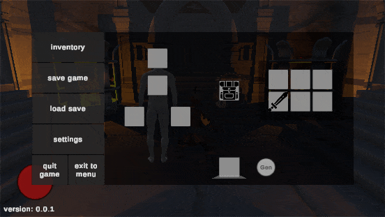
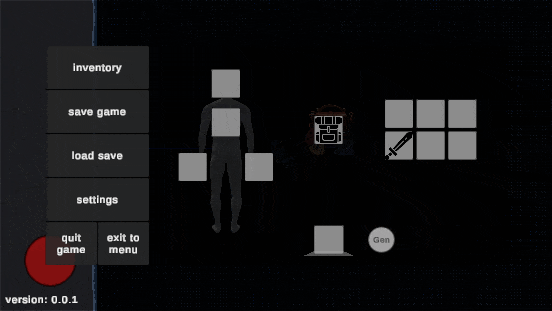
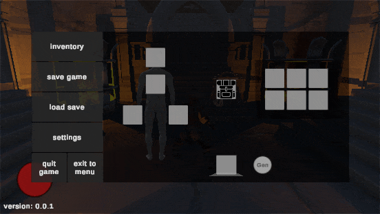
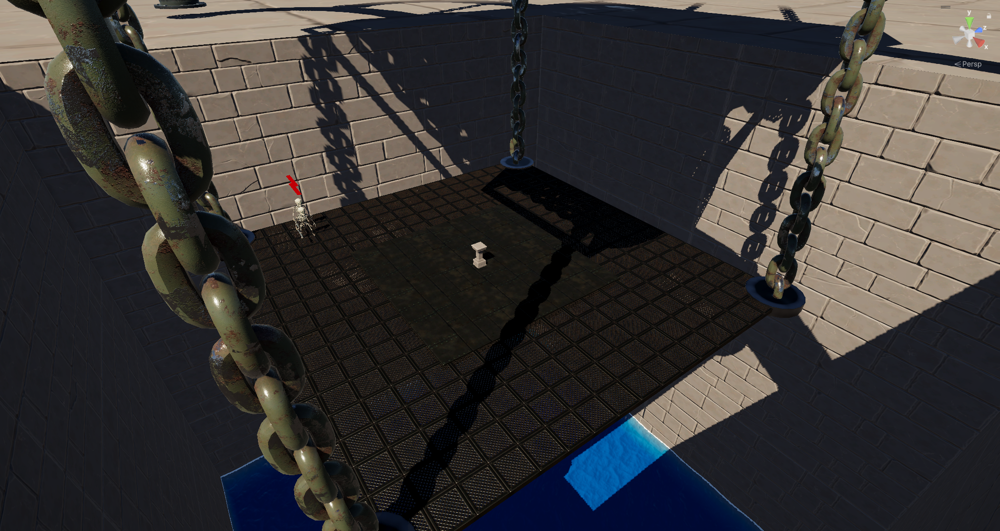

# KnowledgeCheck

**KnowledgeCheck** — это демонстрационный проект, созданный для тестирования новых игровых механик, библиотек и архитектурных подходов. 
Основная цель проекта — показать мой текущий уровень владения программированием и умение интегрировать различные системы в игру.

---

## 🎮 О проекте

Вы играете за воина, очнувшегося в глубинах подземелья. Его единственная цель — выжить и найти путь на свободу.

Проект служит "песочницей", где я внедряю и проверяю:

 - Сложные системы взаимодействия (форки библиотек).
 - Систему сохранений.
 - Алгоритмы поведения ИИ.
 - Различнае механики влияющие на баланс игры.

---

## 🕹 Геймплейные фичи

 - Система инвентаря - Полноценное управление предметами. Каждый предмет обладает уникальными характеристиками, способными влияють на персонажа.
 - Встроенная миниигра - Внутри инвентаря реализована мини-игра, успешное прохождение которой позволяет получать новые предметы.
 - Боевая система: Сражения с врагами, использующими логику преследования и атаки.

В игре присутствует уровень "Лифт" - Финальное испытание. Игроку необходимо оставаться на поднимающейся платформе, отбиваясь от падающих сверху противников.

## 🛠️ Технологии

 - Unity (v.6)
 - C#
 - UniTask
 - JSON.NET
 - Extenject
 - DOTween
 - NavMesh
 - Cinemachine

---

### 🚀 Как запустить

 - Перейдите в раздел Releases.
 - Скачайте архив с последней версией игры.
 - Распакуйте и запустите KnowledgeCheck.exe.
